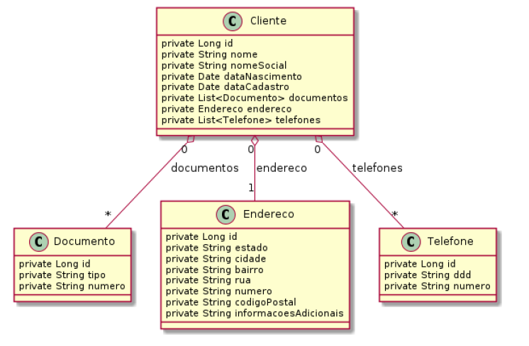
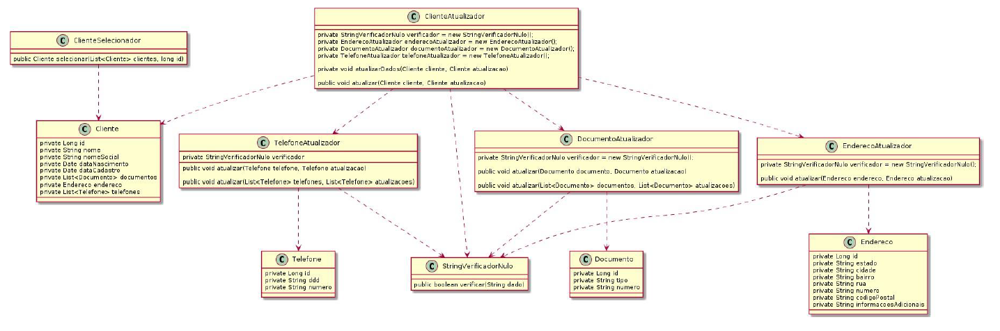
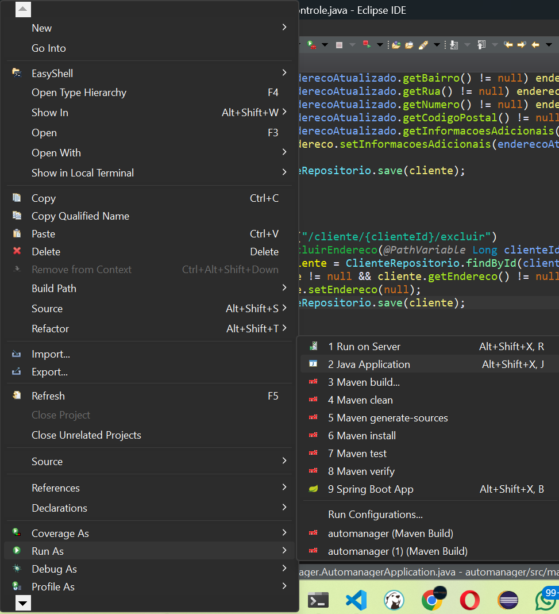

## Atividade I

Empresa criada: AutoBots

Fundador, Dev e Engenheiro de Software: André Salerno

## Objetivo

Construir uma aplicação que funcione de maneira rápida e com acesso via Internet (arquitetura: Microserviços)

Deve-se desenvolver o CRUD para todas as entidades do projeto.  

Obs.: deve-se usar padrões SOLID

## Cadastro de informações dos clientes



## Classes e regras de negócio




## Rodar projeto

### Docker

Primeiro faça um git clone:

```powershell
git clone https://github.com/andresalerno/DES-WEBIII-atvi.git
```

Criar o container do banco de dados MySQL:

```powershell
docker run -d --name atvi -p 3309:3306 -e MYSQL_ROOT_PASSWORD=salerno mysql:latest
```

Abra o Workbenck e crie um banco de dados com o nome `atvi`.


### Execute a aplicação

Baseado na imagem abaixo, sobre o arquivo `AutomanagerApplication.java` clicar com o botão direto e seguir os passos da imagem abaixo.



Obs.: é importante destacar que um container do Docker com o MYSql deve estar rodando


## Endpoints para testes

### Cliente

<div align="left">

|                                                                    Tipo | Rota                     | Ação                               |
| ----------------------------------------------------------------------: | :----------------------- | :--------------------------------- |
|    []() | `http://localhost:8080/cliente/clientes`                | Listagem de clientes             |
|    []() | `http://localhost:8080/cliente/cliente/1`            | Listar cliente by id     |
|   []() | `http://localhost:8080/cliente/cadastro`          | Cadastro de cliente              |
|    []() | `http://localhost:8080/cliente/atualizar`          | Alteração dos dados do cliente     |
| []() | `http://localhost:8080/cliente/excluir`     | Exclusão de cliente             |

### Modelos Json

```json
#post cliente
{
	"nome": "Pedro Alcântara de Bragança e Bourbon",
	"nomeSocial": "Dom Pedro Alcantara",
	"dataNascimento": "2002-06-15T23:32:33.383+00:00",
	"dataCadastro": "2025-03-14T23:32:33.383+00:00"
}
```

```json
#put cliente
{
    "id": 2,
    "nome": "Pedro Alcântara de Bragança e Bourbon",
    "nomeSocial": "Dom Pedro Alcantaraaaaaaaaa",
    "dataNascimento": "2002-06-15T23:32:33.383+00:00",
    "dataCadastro": "2025-03-14T23:32:33.383+00:00"
}
```

```json
# delete cliente
{
    "id": 2
}
```

### Documento

Obs.: relação 1:n

<div align="left">

|                                                                    Tipo | Rota                     | Ação                               |
| ----------------------------------------------------------------------: | :----------------------- | :--------------------------------- |
|    []() | `http://localhost:8080/documento/documentos`                | Listagem de documentos           |
|    []() | `http://localhost:8080/documento/documento/1`            | Listar documento by id     |
|   []() | `http://localhost:8080/documento/cliente/1/cadastrar`          | Cadastro de cdocumento           |
|    []() | `http://localhost:8080/documento/cliente/1/atualizar/1`          | Alteração dos dados do documento de um cliente     |
| []() | `http://localhost:8080/documento/cliente/1/excluir/1`     | Exclusão de um documento de um cliente            |

### Modelos Json

```json
#post documento
# importante destacar que a coluna de numero está como unique, logo, se for repetir o número não será adicionado.
{
	"tipo": "CPF",
	"numero": "1501"
}
```

```json
#put documento
{
	"tipo": "Passaporte",
	"numero": "150022222"
}
```

### Endereço

Obs.: relação 1:n

<div align="left">

|                                                                    Tipo | Rota                     | Ação                               |
| ----------------------------------------------------------------------: | :----------------------- | :--------------------------------- |
|    []() | `http://localhost:8080/endereco/enderecos-clientes`                | Listagem de endereços com seus respectivos clientes           |
|    []() | `http://localhost:8080/endereco/endereco/1`            | Listar endereço by id     |
|   []() | `http://localhost:8080/endereco/cliente/1/cadastrar-endereco`          | Cadastro de endereço          |
|    []() | `hhttp://localhost:8080/endereco/cliente/1/atualizar-endereco`          | Alteração dos dados do endereço de um cliente     |
| []() | `http://localhost:8080/endereco/cliente/1/excluir`     | Exclusão de um endereço de um cliente            |

### Modelos Json

```json
#post endereco
{
	"estado": "Rio de Janeiro",
	"cidade": "Rio de Janeiro",
	"bairro": "Copacabana",
	"rua": "Avenida Atlântica",
	"numero": "17022222222",
	"codigoPostal": "22021001",
	"informacoesAdicionais": "Hotel Copacabana palace"
}
```

```json
#put endereço
{
	"estado": "Pará",
	"cidade": "Rio de Janeiro",
	"bairro": "Copacabana",
	"rua": "Avenida Atlântica",
	"numero": "1702",
	"codigoPostal": "22021001",
	"informacoesAdicionais": "Hotel Copacabana palace"
}
```

### Telefone

Obs.: relação 1:n

<div align="left">

|                                                                    Tipo | Rota                     | Ação                               |
| ----------------------------------------------------------------------: | :----------------------- | :--------------------------------- |
|    []() | `http://localhost:8080/telefone/telefones`                | Listagem de telefones          |
|    []() | `http://localhost:8080/telefone/telefone/1`            | Listar telefone by id     |
|   []() | `hhttp://localhost:8080/telefone/cliente/1/cadastrar`          | Cadastro de cdocumento           |
|    []() | `http://localhost:8080/telefone/cliente/1/atualizar/1`          | Alteração dos dados do telefone   |
| []() | `http://localhost:8080/telefone/cliente/1/excluir/2`     | Exclusão de um documento de um cliente            |

### Modelos Json

```json
#post telefone
{
  "ddd": "31",
  "numero": "987654321"
}
```

```json
#put telefone
{
  "ddd": "21",
  "numero": "987654321"
}
```